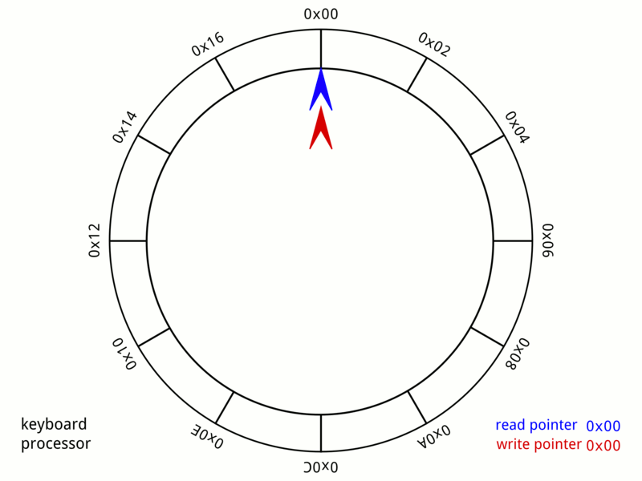

# Handmade Hero Day009, Variable-Pitch Sine Wave Output

## 概述

Day009录制与感恩节假期，因此时间会比普通的时间要长一些本周的内容还是与`DirectSound`相关。
基于Day008的代码，将填充DirectSound的部分进行了修改，从方波变成了正弦波，还优化和调整了部分的代码。

### 方波到正弦波

声音的属性
* 音高，主要由频率决定
* 响度，主要由振幅决定
* 音色，主要是泛音决定

数字信号相关属性
* 采样率
* 频道，数字信号中不同的频道会输出给不同的设备
* 采样大小，每一次采样的精度

若干波形的示意图如下图：


Day009里面Casey主要目标是生成一个pure tune的正弦波声音，即频率是固定。
虽然之前的方波也是固定频率的波形但是不是太耳朵友好的内容。
主要的修改的内容就是将填充相关`SoundBuffer`的地方引入了相关`sine`函数。

```c++
float SineValue = sinf(SoundOutput->tSine);
int16_t SampleValue = (int16_t)(SineValue * SoundOutput->ToneVolume); 
SoundOutput->tSine += 2.0f * Pi32 / (float)SoundOutput->WavePeriod; // 减少SoundSkip
*SampleOut++ = SampleValue;
*SampleOut++ = SampleValue;
++SoundOutput->RunningSampleIndex;
```

- Channel是什么


## 改变声音的音高

将改变频率的相关代码加入键盘控制的处理函数当中。

```c++
case VK_UP:
{
	// this might overflow
	GlobalSoundOutput.ToneHz *= 1.1f;
	GlobalSoundOutput.WavePeriod = GlobalSoundOutput.SamplesPerSecond / GlobalSoundOutput.ToneHz;
} break;
```

## 减少延迟

```c++
DWORD PlayCursor, WriteCursor;
if(SUCCEEDED(GlobalSecondaryBuffer->GetCurrentPosition(&PlayCursor, &WriteCursor)))
{
	// only update the buffer one, then loop
	// NOTE(ykdu): DirectSound test here
	DWORD ByteToLock = (GlobalSoundOutput.RunningSampleIndex * GlobalSoundOutput.BytesPerSample) % GlobalSoundOutput.SecondaryBufferSize;
	// NOTE(ykdu) why this?
	DWORD TargetCursor = ((PlayCursor + (GlobalSoundOutput.LatencySampleCount * GlobalSoundOutput.BytesPerSample)) % GlobalSoundOutput.SecondaryBufferSize);
	DWORD BytesToWrite = 0;
	// TODO(ykdu): PlayCursor, Might not be updated in time,
	if(ByteToLock > TargetCursor)
	{
		BytesToWrite = (GlobalSoundOutput.SecondaryBufferSize - ByteToLock);
		BytesToWrite += TargetCursor;
	}
	else
	{
		BytesToWrite = TargetCursor - ByteToLock;
	}
	win32FillSoundBuffer(&GlobalSoundOutput, ByteToLock, BytesToWrite);
}
```


## 其他内容

* math.h，Casey以后打算自己写一个数学类
* Stroy Time，调试Audio相关的代码，还是需要一个好的耳机

## 问题

1. 当听到的声音出现异常的时候如何快速定位错误？（通常情况我们会首先眼睛去定位bug的位置）
