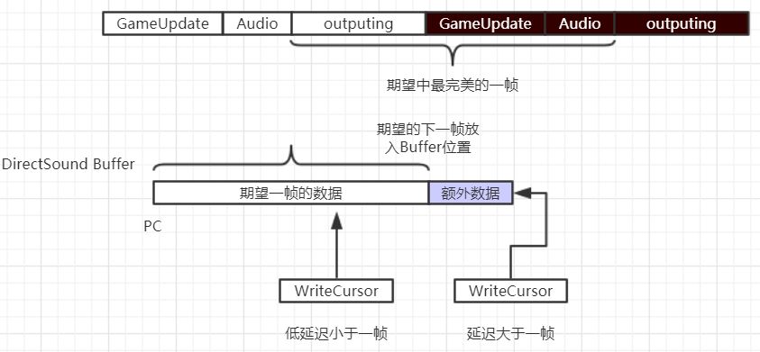

# Handmade Hero Day019, Improving Audio Synchronization

* day19-20预计将会是在windows layer开发的最后两天
* 主要工作是处理锁帧之后发现的声音的效果问题，sound gap

## Debug Method

直接Ouput到屏幕
* 记录最近15个操作的PlayCursor以及WriteCursor的位置
* 将SoundBuffer的PlayCursor以及WriteCursor输出到屏幕上面
* 将SoundBufer映射到RenderBuffer，画下测试线条
   
输出到Log：
* 每一个Frame打印，关于SoundBuffer的相关参数包括
	* LastPlayCursor, 上一次进行计算的时候使用的PlayCursor位置
	* ByteToLock, 当前需要开始写入的位置
	* TargetCursor, 基于PlayCursor加上延迟的播放改变位置
	* PlayCursor, 打印输出函数时候的PlayCursor
	* WriteCursor,  打印输出函数时候的WriteCursor
		
* 屏蔽其他的功能只输出自己想要的日志，只输出期望的内容

## 总结

* 前面一大部分
	
  
# day020 Debugging the Audio Sync

* 问题产生的原因




```c++
if(!SoundIsValid)
{
	GlobalSoundOutput.RunningSampleIndex = WriteCursor / GlobalSoundOutput.BytesPerSample;
	SoundIsValid = true;
}
DWORD ByteToLock = ((GlobalSoundOutput.RunningSampleIndex*GlobalSoundOutput.BytesPerSample) %
	                 GlobalSoundOutput.SecondaryBufferSize);

DWORD ExpectedSoundBytesPerFrame =
	(GlobalSoundOutput.SamplesPerSecond*GlobalSoundOutput.BytesPerSample) / GameUpdateHz;
float SecondsLeftUntilFlip = (TargetSecondsPerFrame - FromBeginToAudioSeconds);
DWORD ExpectedBytesUntilFlip = (DWORD)((SecondsLeftUntilFlip/TargetSecondsPerFrame)*(float)ExpectedSoundBytesPerFrame);

// 期望可以完整的放下一帧的数据
DWORD ExpectedFrameBoundaryByte = PlayCursor + ExpectedSoundBytesPerFrame;
                        
DWORD SafeWriteCursor = WriteCursor;
// 调整wc与pc使 wc > pc
if(SafeWriteCursor < PlayCursor)
{
	SafeWriteCursor += GlobalSoundOutput.SecondaryBufferSize;
}
Assert(SafeWriteCursor >= PlayCursor);
// add samplepersecond / 30 / 3
SafeWriteCursor += GlobalSoundOutput.SafetyBytes;

// game将会在下一帧的地方放入数据，如果当前下写指针的位置大于当前期望的写地址，那么就会有一部分的数据来不及写入
bool AudioCardIsLowLatency = (SafeWriteCursor < ExpectedFrameBoundaryByte);                        

// 如果是lowlantency说明，知道下一帧插入新的数据之前的所有数据都已经写入，那么接着写入
// 否者只能从当前的wc开始写入，完整一帧数据加上
DWORD TargetCursor = 0;
if(AudioCardIsLowLatency)
{
	TargetCursor = (ExpectedFrameBoundaryByte + ExpectedSoundBytesPerFrame);
}
else
{
	TargetCursor = (WriteCursor + ExpectedSoundBytesPerFrame +
	                GlobalSoundOutput.SafetyBytes);
}
TargetCursor = (TargetCursor % GlobalSoundOutput.SecondaryBufferSize);
```
